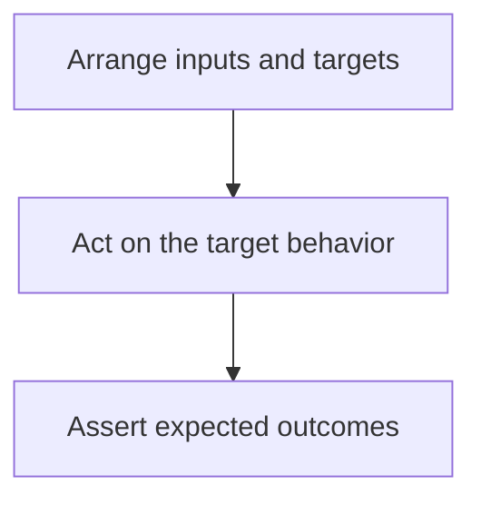
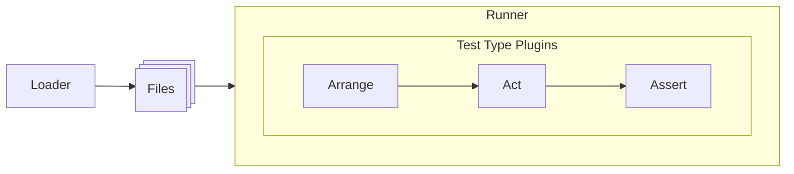

# Declarative Test Cases

## Introduction

Declarative Test Case was created to avoid writing code to test the code (in the end, who tests the test?). The main idea is to have a similar way of thinking while writing tests. Using the same data and structure format, something that can be shared between people with different knowledge level and abilities.

The executing and plugins flow follow the Arrange-Act-Assert pattern:

# Architecture

The library architecture is divided in four main parts: Loader, Runner, Test Types and Plugins

## Loader

By default DTC loads Javascript files expecting the content to be default exported, but you can basically load any file type by configuring a custom loader.

## Runner

By default DTC use Node Native Test Runner Javascript, but it is also flexible to be configured to use Jest, Playwright or any other Test Runner.

## Default test types

- Unit: it runs small set of code
- Narrow: for integration tests mocking network, like HTTP calls
- Broad: for integration tests using network

